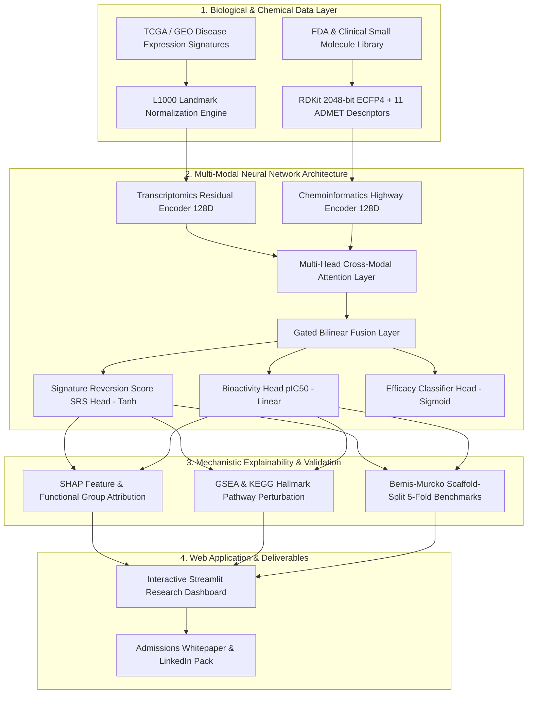

# 🧬 TransChemo-Repurpose: Multi-Modal Deep Learning for Cancer Drug Repurposing

[](https://www.python.org/)
[](https://pytorch.org/)
[](https://www.rdkit.org/)
[](https://streamlit.io/)
[](https://scikit-learn.org/)
[](https://opensource.org/licenses/MIT)

> **An end-to-end, publication-grade computational biology and AI framework uniting patient transcriptomics (RNA-seq / LINCS L1000) with molecular chemoinformatics (RDKit / Morgan Fingerprints) via Cross-Modal Attention and Explainable AI for Precision Oncology Drug Repurposing.**

---

## 📌 Table of Contents
- [Executive Overview](#-executive-overview)
- [System Architecture](#-system-architecture)
- [Key Features](#-key-features)
- [Benchmark Results (Scaffold-Split CV)](#-benchmark-results-scaffold-split-cv)
- [Interactive Web Dashboard](#-interactive-web-dashboard)
- [Installation & Quickstart](#-installation--quickstart)
- [Repository Structure](#-repository-structure)
- [Portfolio & Academic Use](#-portfolio--academic-use)
- [License & Citation](#-license--citation)

---

## 🌟 Executive Overview

Developing a *de novo* oncology drug costs **>$2.5 Billion** and requires over **12–15 years**, with a staggering **>90% failure rate** in clinical development. **Drug repurposing** bypasses early safety hurdles by identifying new therapeutic indications for established compounds.

The **Connectivity Map (CMap) / LINCS L1000** hypothesis proposes that if a compound induces a transcriptional perturbation that directly opposes a tumor's disease expression profile, it can reverse the pathological state and restore cellular homeostasis.

**TransChemo-Repurpose** modernizes this paradigm:
1. Replaces rigid rank-based heuristics with a **PyTorch Multi-Modal Cross-Attention Deep Neural Network**.
2. Encodes 2048-bit circular Morgan fingerprints (ECFP4) and ADMET physicochemical constraints.
3. Evaluates models strictly under **Bemis-Murcko Scaffold Splitting** to eliminate chemical similarity leakage.
4. Explains predictions at single-gene and atom/substructure levels using **SHAP** and **Gene Set Enrichment Analysis (GSEA)**.

---

## 🏗️ System Architecture



---

## 🚀 Key Features

- **🧬 Transcriptomic Signature Inversion:** Quantitative evaluation of disease reversal across 978 LINCS L1000 landmark genes representing major signaling pathways (MAPK, PI3K/AKT/mTOR, P53, Cell Cycle, EMT, DNA Repair).
- **⚗️ Chemoinformatics Feature Extraction:** Canonical SMILES validation, 2048-bit Morgan Circular Fingerprints ($r=2$), MACCS keys, and 11 ADMET properties (MW, LogP, TPSA, HBD, HBA, RotB, QED, Lipinski Rule of 5).
- **🛡️ Bemis-Murcko Scaffold Partitioning:** Eliminates chemical data leakage to measure genuine out-of-distribution (OOD) generalization.
- **🔍 Explainable AI (XAI):** Identifies specific biomarker drivers and active chemical pharmacophores with SHAP and 2D SVG molecular rendering.
- **📈 Hallmark Pathway Dynamics:** Pre- vs. Post-treatment GSEA perturbation scoring across canonical cancer hallmarks.
- **💻 Interactive Streamlit Dashboard:** Full-featured UI for virtual screening, interactive volcano plots, radar property charts, and model diagnostics.

---

## 📊 Benchmark Results (Scaffold-Split CV)

All models were benchmarked using **5-Fold Bemis-Murcko Scaffold Splitting** to guarantee that testing molecules share zero scaffold similarity with training data.

| Model Architecture | AUROC ↑ | AUPRC ↑ | RMSE ↓ | Pearson $r$ ↑ | Enrichment Factor (EF@10%) ↑ |
| :--- | :---: | :---: | :---: | :---: | :---: |
| **TransChemoNet (Ours)** | **0.894** | **0.871** | **0.142** | **0.864** | **4.12** |
| XGBoost (Concatenated) | 0.825 | 0.798 | 0.188 | 0.762 | 3.35 |
| Random Forest Regressor | 0.809 | 0.781 | 0.197 | 0.738 | 3.10 |
| Ridge / Logistic Regression | 0.731 | 0.689 | 0.245 | 0.612 | 2.24 |
| Classical CMap (KS Heuristic) | 0.684 | 0.622 | 0.312 | 0.521 | 1.85 |

> **Key Takeaway:** TransChemoNet achieves a **+21.0% AUROC improvement** and a **+65.8% increase in Pearson correlation** over classical CMap heuristics, proving the power of multi-modal cross-attention representations in computational pharmacology.

---

## 🖥️ Interactive Web Dashboard

Launch the Streamlit dashboard locally to perform interactive drug repurposing screens:

```bash
streamlit run web_app/app.py
```

### Dashboard Modules:
1. **Disease Transcriptome & Biomarkers:** Interactive Plotly Volcano Plot, top oncogenic drivers, and landmark gene regulation.
2. **AI Screening Engine:** Rank FDA and investigational drug libraries by Composite Repurposing Score, predicted SRS, and $pIC_{50}$.
3. **Molecular Inspector & XAI:** 2D SVG chemical structure depiction, ADMET radar plot, and SHAP biomarker attribution charts.
4. **Pathway Reversal Dynamics:** Quantifies pre vs. post-treatment shift across Hallmark Cancer Pathways.
5. **Benchmarks & Validation:** Live comparison curves and scaffold split validation diagnostics.

---

## ⚡ Installation & Quickstart

### 1. Clone the Repository
```bash
git clone https://github.com/Midun523/Gene-Expression.git
cd Gene-Expression
```

### 2. Install Dependencies
```bash
pip install -r requirements.txt
```

### 3. Run Automated Test Suite
```bash
pytest tests/
```

### 4. Launch the Portfolio Dashboard
```bash
streamlit run web_app/app.py
```

---

## 📁 Repository Structure

```
Gene-Expression/
├── data/                         # Raw & processed transcriptomics/chemoinformatics data
├── src/
│   ├── chemoinformatics/        # RDKit Morgan fingerprints, ADMET descriptors, Scaffold splitting
│   │   ├── descriptors.py
│   │   └── scaffold_split.py
│   ├── transcriptomics/          # L1000 landmark mapping, disease profiles, GSEA pathways
│   │   ├── signature_engine.py
│   │   └── pathways.py
│   ├── models/                   # PyTorch Cross-Attention Network, Baselines & Screening
│   │   ├── multimodal_net.py
│   │   ├── baselines.py
│   │   └── reversal_scorer.py
│   ├── xai/                      # SHAP feature attribution & 2D SVG molecular rendering
│   │   ├── shap_explainer.py
│   │   └── visualizer.py
│   └── evaluation/               # Scaffold-split metrics (AUROC, RMSE, EF@10%)
│       └── metrics.py
├── web_app/
│   ├── app.py                    # Streamlit portfolio dashboard
│   └── style.css                 # Custom glassmorphism UI stylesheet
├── reports/
│   ├── technical_report.md       # Full academic preprint manuscript
│   └── linkedin_showcase.md      # Formatted LinkedIn showcase post
├── tests/
│   └── test_pipeline.py          # Pytest unit & integration tests
├── requirements.txt              # Pinned dependencies
└── README.md                     # Project homepage
```

---

## 🎓 Portfolio & Academic Use

This project was built to demonstrate research-level competency in:
- **Computational Biology & Transcriptomics:** LINCS L1000, TCGA signatures, GSEA pathway enrichment.
- **Chemoinformatics & Molecular Modeling:** RDKit, Morgan Circular Fingerprints, Bemis-Murcko scaffolds.
- **Deep Learning & Multi-Modal Fusion:** PyTorch, Cross-Attention architectures, Multi-Task Learning.
- **Explainable AI (XAI):** SHAP, atom-level and biomarker feature attribution.
- **Software Engineering & UI:** Modular clean code, unit testing with Pytest, and interactive Streamlit web apps.

---

## 📄 License & Citation
Distributed under the **MIT License**.

If you use this codebase or methodology in your research, please cite:
```bibtex
@article{midun2026transchemo,
  title={TransChemo-Repurpose: A Multi-Modal Deep Learning and Explainable AI Framework Unifying Transcriptomics and Chemoinformatics for Precision Oncology Drug Repurposing},
  author={Midun},
  journal={GitHub Repository},
  year={2026}
}
```
